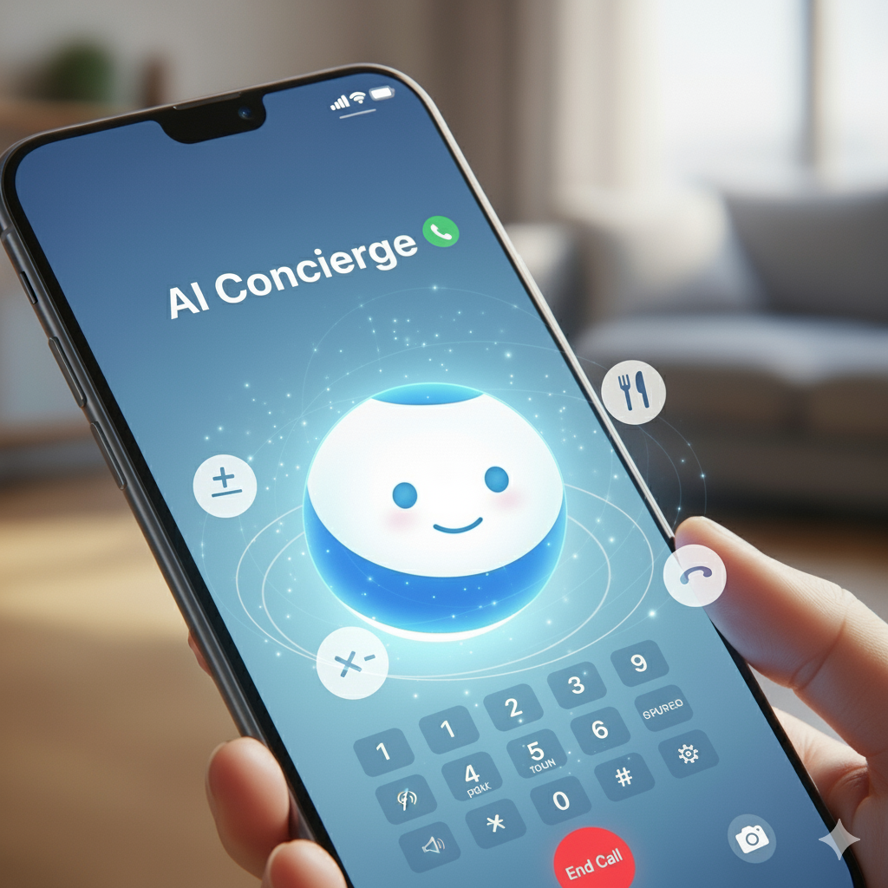

# AI Concierge: Your 24/7 Personal Assistant

## The Problem: Information Overload, Inconvenient Access

In a fast-paced world, managing daily tasks is complex. Traditional digital assistants are often trapped inside apps, requiring specific devices and internet access. We need a simpler, more accessible way to get help.

## Solution: A Conversational AI You Can Call

**AI Concierge** is a 24/7 personal assistant that you can talk to by simply **dialing a phone number**. No app, no internet required on your end—just a natural conversation to get things done.

---

## Key Features & Innovations

*   **Universal Voice Access**: The most intuitive interface is the human voice. By integrating with telephony via SIP, we make powerful AI accessible from any phone, anywhere.

*   **Intelligent Multi-Agent System**: A `MasterAgent` acts as the central coordinator, seamlessly handing off tasks to specialized agents for weather, math, or web searches. This modular design is efficient and highly scalable.

*   **Real-Time, Dynamic Tools**: The concierge can use tools on the fly to browse the web for restaurant recommendations, perform calculations, or access any information needed to answer your questions instantly.

## **Example queries**
- What's the weather like in Bangalore?
- Suggest some 4-star Italian restaurants near me.
- What is domino effect?

## **Tools used**
- Python 3.13
- Livekit (Orchestrator for voice agents)
- OpenAI LLM
- Elevenlabs TTS
- Deepgram STT
- Silero VAD
- Plivo (Internet phone number & SIP Trunk)
- and Windsurf (for vibe coding)

---

## Future Scope

The architecture is designed for growth. Future capabilities are just a tool away:

*   **Calendar Management**: "Book a meeting with John for tomorrow at 2 PM."
*   **Service Booking**: "Book a cab to the airport for me."
*   **Workspace Integration**: "Summarize my unread Slack mentions."
*   **Proactive Assistance**: Imagine the agent calling *you* with a reminder for a meeting and an offer to book a cab.
